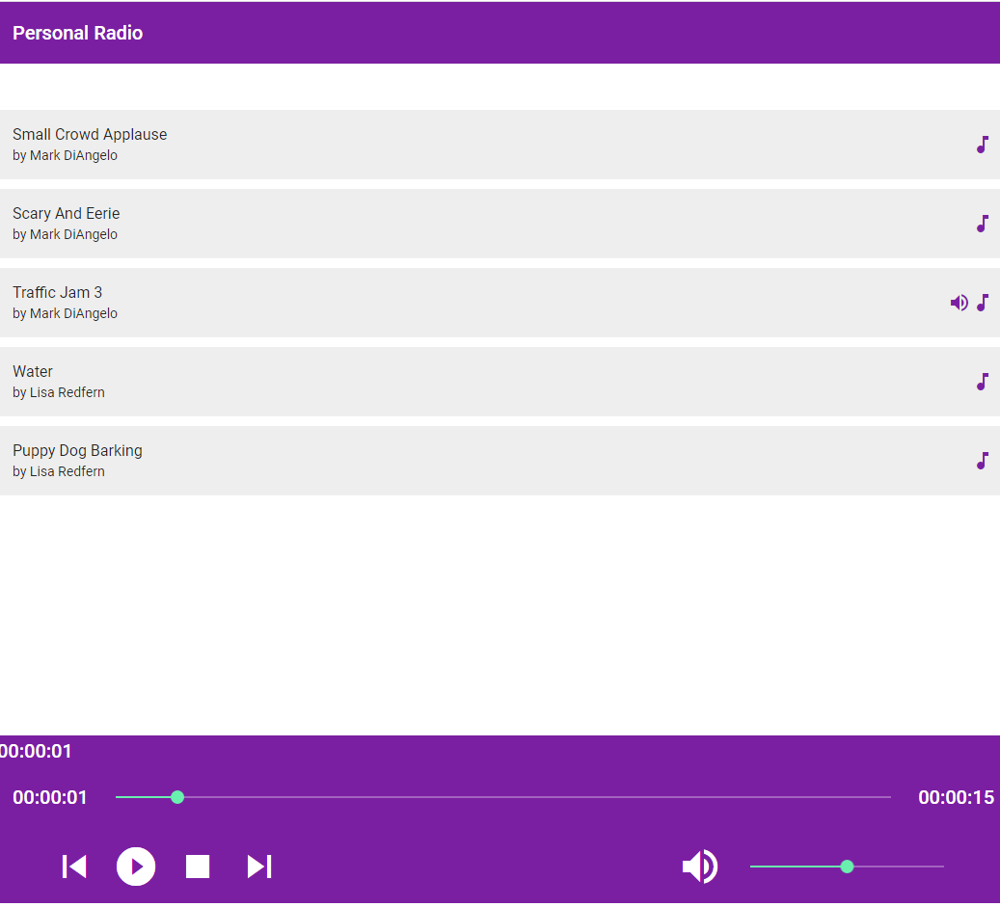

# AngularAudioPlayer
Building an Audio Player with Angular and Angular Material. The following reference tutorial helps me.
https://www.shibajidebnath.com/streaming-audio-player-app-develop-by-angular




1. Create material.module.ts for importing required Angular material modules. Now import material.module.ts in app.module.ts to make available in root module.
2. HttpClientModule is being used for fetching data using httpclient. Currently i am fetching data localy from assests/mockdata.json file.
3. data.service.ts is being used for fetching data and other required sharing functionality like getIndex, addIndex
4. audio.service.ts contains all audio player related functionalities.

```
<div class="song-list" *ngIf="files && files.length > 0">
        <mat-list-item *ngFor="let file of files; let i = index" (click)="openFile(file, i)">  
          <mat-icon color="primary" *ngIf="currentFile.index === i && !state?.error">volume_up</mat-icon>        
          <mat-icon color="primary">music_note</mat-icon>
          <h4 mat-line="">{{ file.name }}</h4>
          <h5 mat-line="">by {{ file.artist }}</h5>          
          <h6 *ngIf="currentFile.index === i &amp;&amp; state?.error">ERROR</h6>
          <mat-divider></mat-divider>
        </mat-list-item>
      </div>
```
files contains songs list. currentFile is used to show play icon of selected song.
openFile(file, i) - by clicking any song, it will start play

```
<mat-toolbar-row cols="2" class="media-action-bar" *ngIf="state">

          <button mat-button="" [disabled]="isFirstPlaying()" (click)="previous()">
            <mat-icon>skip_previous</mat-icon>
          </button>
          <button mat-button="" (click)="play()" [disabled]="state?.error" *ngIf="!state?.playing">
            <mat-icon>play_circle_filled</mat-icon>
          </button>
          <button mat-button="" (click)="pause()" *ngIf="state?.playing">
            <mat-icon>pause</mat-icon>
          </button>
          <button mat-button="" [disabled]="isLastPlaying()" (click)="next()">
            <mat-icon>skip_next</mat-icon>
          </button>

        <span class="spacer"></span>
        <mat-icon>volume_up</mat-icon>
        <!-- <mat-slider class="time-slider" min="0" max="1" step="0.01" [value]="state?.volume" (input)="onVolumeChange($event)"></mat-slider> -->
       
      </mat-toolbar-row>
```

isFirstPlaying() - for first song, previous icon will be disable
isLastPlaying - for last song, next icon will be disable
play() - to play the selected song 
pause() - to pause the selected song


### Reference Urls
https://www.shibajidebnath.com/streaming-audio-player-app-develop-by-angular
https://github.com/imshibaji/AudioFly
https://www.npmjs.com/package/ngx-audio-player

